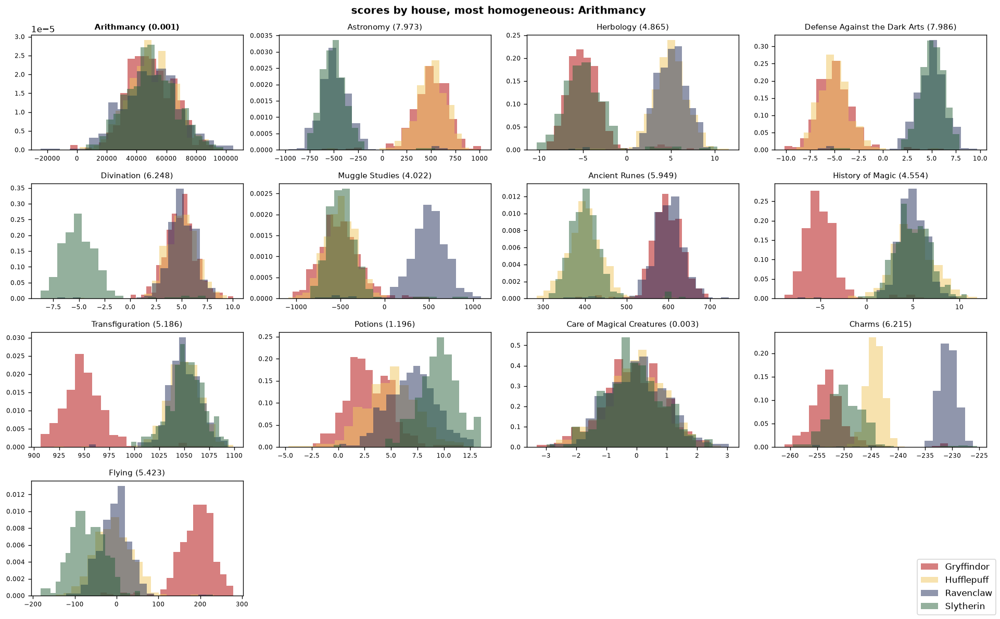
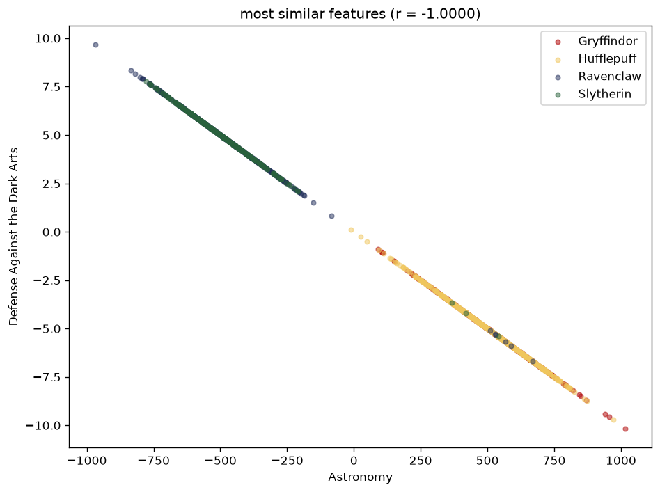
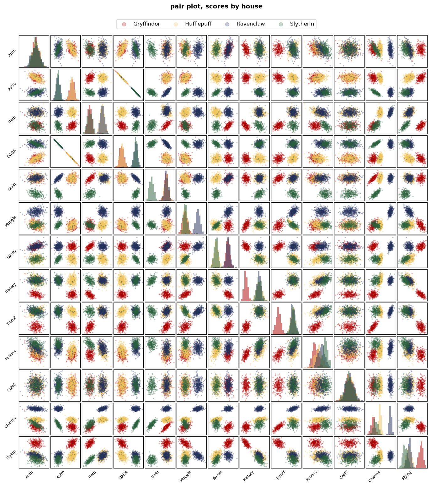

# dslr

## 📖 About

"dslr" (*Data Science × Logistic Regression*) is a machine-learning project
written in **Python**: a Sorting Hat rebuilt from data. Given the marks of
1 600 Hogwarts students in thirteen courses, the program learns which house
each of them belongs to and then sorts 400 new students whose house is
unknown.

The interesting part is that nothing is taken off the shelf. The descriptive
statistics are computed by hand rather than with `pandas.describe`, the
features are chosen by looking at the data — a histogram to find the courses
that say nothing about the house, a scatter plot to find the ones that repeat
each other — and the classifier is a **one-vs-all logistic regression** whose
weights are fitted with **gradient descent** written from the cost function
up. Only the linear algebra is delegated to `numpy` and the drawing to
`matplotlib`; `describe.py` needs nothing beyond the standard library.

The work is split in the four steps of a small data-science pipeline:
**describe** the dataset, **visualize** it to pick the features, **train** a
model and save its weights, **predict** with those weights. The bonus adds
extra statistics to `describe` and two more optimizers to the training —
mini-batch and stochastic gradient descent.

## 🎯 Objectives

- Reading a CSV of untrusted values, where any cell may be empty or malformed
- Reimplementing count, mean, standard deviation, quartiles and the rest without
  the library functions that already do the job
- Reading distributions from plots to decide which features are useless,
  which are redundant and which separate the classes
- Turning a four-class problem into four binary ones with **one-vs-all**
- Implementing the **sigmoid**, the **cross-entropy** cost and its gradient
- Fitting the weights with **batch**, **mini-batch** and **stochastic** gradient
  descent
- Standardizing the features and imputing the missing marks so that every
  course weighs the same during training
- Serializing the model so prediction does not depend on the training data
- Reaching at least 98 % accuracy on students the model has never seen

## 📋 Function Overview

<details>
<summary><strong>dslr — modules breakdown</strong></summary>

<br>

| Module | Feature | Description |
|--------|---------|-------------|
| **dslr** | Dataset loading | `csv.DictReader` in one pass; rejects an unreadable file, an empty one or one that lacks the needed columns |
| **dslr** | Labeled rows | With `labeled=True` the rows whose `Hogwarts House` is empty or unknown are dropped |
| **dslr** | Cell parsing | `number` returns a `float`, or `None` for an empty cell, text, `nan` or `inf` |
| **dslr** | Display fallback | `show` opens a window, or writes a PNG when matplotlib has no interactive backend |
| **describe** | Numeric columns | A column counts as numeric when every non-empty cell parses as a float; non-finite values count as missing |
| **describe** | Statistics by hand | Count, mean, std, min, quartiles and max computed with plain loops, no `len`, `sum`, `min`, `max` or `statistics` |
| **describe** | Percentiles | Linear interpolation between the two nearest ranks, the method `numpy` and `pandas` use |
| **describe** | Extra fields | `missing`, `var`, `range`, `iqr` and `skew` on top of the eight standard rows |
| **describe** | Table layout | Columns split into blocks that fit the terminal width, as `pandas` prints wide frames |
| **histogram** | Homogeneity score | Variance of the four house means over the mean variance inside the houses; the lowest ratio is the most homogeneous course |
| **histogram** | 4 × 4 grid | One density histogram per course, the four houses overlaid, the answer highlighted in bold |
| **scatter_plot** | Pearson correlation | `r` on the 78 pairs of courses, the five highest `abs(r)` printed, the best one plotted |
| **pair_plot** | 13 × 13 matrix | Histograms on the diagonal, scatter plots elsewhere, house colours everywhere |
| **logreg_train** | Feature selection | Ten courses: `Arithmancy` and `Care of Magical Creatures` are dropped as homogeneous, `Astronomy` as a copy of `Defense Against the Dark Arts` |
| **logreg_train** | Preprocessing | Missing marks replaced by the column mean, then standardization, then a bias column of ones |
| **logreg_train** | One-vs-all | Four binary classifiers, one per house, each trained on `y = 1` for that house and `0` for the rest |
| **logreg_train** | Gradient descent | Batch (`lr 0.5`, 2 000 epochs), mini-batch (`lr 0.1`, 100 epochs, 32 rows) or SGD (`lr 0.01`, 20 epochs); shuffling seeded so runs repeat |
| **logreg_train** | Model file | `weights.json` with the feature list, the training mean and std, and the eleven weights of each house |
| **logreg_predict** | Model loading | The JSON is checked field by field and shape by shape; a corrupt file is refused with the reason |
| **logreg_predict** | Prediction | `sigmoid(X · Wᵀ)` for the four houses at once, `argmax` per row, `houses.csv` with `Index, Hogwarts House` |

<br>

</details>

<details>
<summary><strong>Usage Example & Testing</strong></summary>

### Install and run

```bash
pip install -r requirements.txt                          # numpy and matplotlib
python3 srcs/describe.py datasets/dataset_train.csv
python3 srcs/histogram.py datasets/dataset_train.csv
python3 srcs/scatter_plot.py datasets/dataset_train.csv
python3 srcs/pair_plot.py datasets/dataset_train.csv
python3 srcs/logreg_train.py datasets/dataset_train.csv   # writes weights.json
python3 srcs/logreg_predict.py datasets/dataset_test.csv weights.json   # writes houses.csv
```

### Describing the dataset

```bash
$ python3 srcs/describe.py datasets/dataset_train.csv
                  Index        Arithmancy      Astronomy    Herbology  Defense Against the Dark Arts   Divination
count       1600.000000       1566.000000    1568.000000  1567.000000                    1569.000000  1561.000000
mean         799.500000      49634.570243      39.797131     1.141020                      -0.387863     3.153910
std          462.024530      16679.806036     520.298268     5.219682                       5.212794     4.155301
min            0.000000     -24370.000000    -966.740546   -10.295663                     -10.162119    -8.727000
25%          399.750000      38511.500000    -489.551387    -4.308182                      -5.259095     3.099000
50%          799.500000      49013.500000     260.289446     3.469012                      -2.589342     4.624000
75%         1199.250000      60811.250000     524.771949     5.419183                       4.904680     5.667000
max         1599.000000     104956.000000    1016.211940    11.612895                       9.667405    10.032000
missing        0.000000         34.000000      32.000000    33.000000                      31.000000    39.000000
var       213466.666667  278215929.383881  270710.287273    27.245080                      27.173218    17.266526
range       1599.000000     129326.000000    1982.952486    21.908558                      19.829525    18.759000
iqr          799.500000      22299.750000    1014.323336     9.727365                      10.163775     2.568000
skew           0.000000         -0.041919      -0.094635    -0.398379                       0.093258    -1.379198

          Muggle Studies  Ancient Runes  History of Magic  Transfiguration      Potions  Care of Magical Creatures
…
```

Fourteen numeric columns, the eight standard rows and the five bonus ones.
Every value agrees with `numpy` to within 2 × 10⁻¹⁵.

### Choosing the features

```bash
$ python3 srcs/histogram.py datasets/dataset_train.csv
Arithmancy                     0.0006
Care of Magical Creatures      0.0032
Potions                        1.1961
Muggle Studies                 4.0221
…
Defense Against the Dark Arts  7.9861
most homogeneous: Arithmancy

$ python3 srcs/scatter_plot.py datasets/dataset_train.csv
Astronomy                      Defense Against the Dark Arts  r = -1.0000
History of Magic               Flying                         r = -0.8963
Transfiguration                Flying                         r = -0.8737
History of Magic               Transfiguration                r = 0.8492
Muggle Studies                 Charms                         r = 0.8476
most similar: Astronomy and Defense Against the Dark Arts
```

`Arithmancy` and `Care of Magical Creatures` have the same distribution in
every house, so they cannot help sort anyone; `Astronomy` is exactly
`-100 × Defense Against the Dark Arts` on every student, so it says nothing
the other does not. The remaining ten courses are what the model trains on.

### Training and predicting

```bash
$ python3 srcs/logreg_train.py datasets/dataset_train.csv
batch gradient descent: lr 0.5, 2000 epochs, batch size 1600
Gryffindor  loss 0.0441
Hufflepuff  loss 0.0588
Ravenclaw   loss 0.0687
Slytherin   loss 0.0472
training accuracy: 0.9819
weights saved to weights.json

$ python3 srcs/logreg_predict.py datasets/dataset_test.csv weights.json
400 predictions saved to houses.csv
$ head -4 houses.csv
Index,Hogwarts House
0,Hufflepuff
1,Ravenclaw
2,Gryffindor
```

The bonus optimizers reach the same accuracy in fewer passes over the data:

```bash
python3 srcs/logreg_train.py datasets/dataset_train.csv minibatch   # 100 epochs, 32 rows per step
python3 srcs/logreg_train.py datasets/dataset_train.csv sgd         # 20 epochs, 1 row per step
```

### Checking the predictions

To score `houses.csv` against a file that holds the real houses in the same
two columns:

```bash
python3 - <<'EOF'
import csv
truth = {r["Index"]: r["Hogwarts House"] for r in csv.DictReader(open("dataset_truth.csv"))}
pred = {r["Index"]: r["Hogwarts House"] for r in csv.DictReader(open("houses.csv"))}
print(f"accuracy {sum(truth[i] == pred[i] for i in truth) / len(truth):.4f}")
EOF
```

Without the truth file, hold out part of the training set: on three random
80 / 20 splits of `dataset_train.csv` the three optimizers all score between
98.4 % and 98.8 % on the 320 students they did not train on.

### Error handling

```bash
$ python3 srcs/describe.py
usage: describe.py dataset.csv
$ python3 srcs/describe.py nope.csv
describe: [Errno 2] No such file or directory: 'nope.csv'
$ python3 srcs/histogram.py datasets/dataset_test.csv
histogram: datasets/dataset_test.csv: no labeled rows (Hogwarts House is empty)
$ python3 srcs/logreg_predict.py datasets/dataset_test.csv bad.json
logreg_predict: bad.json: corrupt weights file ('features'), run logreg_train.py
$ python3 srcs/logreg_train.py datasets/dataset_train.csv adam
usage: logreg_train.py dataset.csv [batch|minibatch|sgd]
```

A missing or unreadable file, a file that is not a CSV, a dataset without
the needed columns or without a single labeled row, a feature without any
value, and a weights file with the wrong keys or shapes all print a message
on standard error and exit with status 1.

<br>

</details>

## 🚀 Installation & Structure

<details>
<summary><strong>📥 Setup & Usage</strong></summary>

<br>

### Host requirements

| Tool | Needed for | Notes |
|------|------------|-------|
| `python3` | Everything | Tested with 3.14, nothing newer than 3.8 is used |
| `numpy` ≥ 1.21 | `logreg_train`, `logreg_predict` | Matrix products and the random shuffle |
| `matplotlib` ≥ 3.5 | `histogram`, `scatter_plot`, `pair_plot` | Falls back to a PNG when there is no display |

`describe.py` runs on the standard library alone.

### Install

```bash
python3 -m venv .venv && source .venv/bin/activate      # optional
pip install -r requirements.txt
```

### Running

Every script takes the dataset as its first argument and is run from the
root of the repository; the files it writes land in the current directory.

```bash
python3 srcs/describe.py datasets/dataset_train.csv
python3 srcs/histogram.py datasets/dataset_train.csv            # window, or histogram.png
python3 srcs/scatter_plot.py datasets/dataset_train.csv         # window, or scatter_plot.png
python3 srcs/pair_plot.py datasets/dataset_train.csv            # window, or pair_plot.png
python3 srcs/logreg_train.py datasets/dataset_train.csv [batch|minibatch|sgd]   # weights.json
python3 srcs/logreg_predict.py datasets/dataset_test.csv weights.json           # houses.csv
MPLBACKEND=agg python3 srcs/pair_plot.py datasets/dataset_train.csv   # force the PNG
```

### Dataset format

```
Index,Hogwarts House,First Name,Last Name,Birthday,Best Hand,Arithmancy,Astronomy,…,Flying
0,Ravenclaw,Tamara,Hsu,2000-03-30,Left,58384.0,-487.88608595139016,…,-26.89
1,Slytherin,Erich,Paredes,1999-10-14,Right,67239.0,-552.0605073421984,…,-113.45
```

One student per row, thirteen course columns after the six descriptive ones.
The training set has 1 600 rows with a house, the test set 400 rows with the
house column empty. Any mark may be missing; `describe` counts it, the plots
skip the student for that course and the model replaces it by the mean.

<br>

</details>

<details>
<summary><strong>📁 Project Structure</strong></summary>

<br>

```
dslr/
│
├── README.md                             # Main project documentation
├── requirements.txt                      # numpy and matplotlib
├── .gitignore                            # weights.json, houses.csv and PNGs (docs/img is kept)
│
├── docs/
│   ├── README.md                         # Condensed project documentation
│   └── img/
│       ├── histogram.png                 # Output of histogram.py on the training set
│       ├── scatter_plot.png              # Output of scatter_plot.py
│       └── pair_plot.png                 # Output of pair_plot.py
│
├── datasets/
│   ├── dataset_train.csv                 # 1 600 students with their house
│   └── dataset_test.csv                  # 400 students to sort, house column empty
│
└── srcs/
    ├── dslr.py                           # Shared: houses, courses, colours, CSV loading, cell parsing, show()
    ├── describe.py                       # Statistics by hand, one column per numeric feature
    ├── histogram.py                      # Homogeneity score per course, 4 x 4 grid of histograms
    ├── scatter_plot.py                   # Pearson correlation per pair, the most similar pair plotted
    ├── pair_plot.py                      # 13 x 13 scatter matrix with histograms on the diagonal
    ├── logreg_train.py                   # Features, preprocessing, one-vs-all gradient descent, weights.json
    └── logreg_predict.py                 # Loads weights.json, sorts a dataset into houses.csv
```

`dslr.py` is the module the six programs share: the house and course lists,
the colours, `load_dataset` with its checks and `show` with its PNG fallback.
`logreg_predict.py` also imports `features`, `prepare` and `sigmoid` from
`logreg_train.py`, so the exact preprocessing used to fit the weights is the
one applied at prediction time.

<br>

</details>

<details>
<summary><strong>🧱 Algorithm Overview</strong></summary>

<br>

### Pipeline

```
csv ─> features ─> impute mean ─> standardize ─> bias ─> 4 x sigmoid(θᵀx) ─> argmax ─> houses.csv
                        └──────── mean, std saved in weights.json ────────┘
```

### Describe — statistics by hand

Every statistic is written with plain loops: `count` walks the list,
`mean` is the total over the count, `variance` is the sample one divided by
`n - 1` as `pandas` does, `std` its square root. A percentile `p` is read at
rank `p / 100 × (n - 1)` of the sorted values, interpolating linearly between
the two integers around it, which is what `numpy.percentile` and
`pandas.describe` do by default. Skewness is the mean of the cubed
standardized deviations: 0 for a symmetric distribution, negative when the
tail is on the left.

### Which courses to keep

```
histogram      Arithmancy  0.0006     same curve in the four houses  ->  dropped
               CoMC        0.0032     same curve in the four houses  ->  dropped
scatter_plot   Astronomy = -100 x DADA    r = -1.0000                ->  Astronomy dropped
                                                                      10 courses kept
```

The homogeneity score of a course is the variance of its four house means
over the mean of its four within-house variances: near zero, the houses sit
on top of each other and the course carries no information. The Pearson
coefficient finds the pair of courses that are a linear function of one
another; keeping both would just give the same feature twice the weight.

### Preprocessing

```
x_missing  <-  mean of the column          (0 once standardized: no push either way)
x          <-  (x - mean) / std            Arithmancy spans 10⁵, Care of Magical Creatures 10⁰
X          <-  [ 1 | x₁ … x₁₀ ]            the 1 carries the bias θ₀
```

Without standardization one learning rate cannot fit every column: the step
that is right for a feature spread over 100 000 is far too small for one
spread over 3. The mean and std of the training set go into `weights.json`
so that `logreg_predict` applies the very same transform.

### Logistic regression, one-vs-all

```
h(x) = σ(θᵀx) = 1 / (1 + e^(-θᵀx))                         probability of the house

J(θ) = -1/m · Σ [ y·log h(x) + (1 - y)·log(1 - h(x)) ]     cross-entropy

θ  <-  θ - α · 1/m · Xᵀ (h(X) - y)                          one gradient step
```

Each house gets its own `θ` of eleven weights, trained with `y = 1` on its
students and `y = 0` on everybody else. To sort a student the four
probabilities are computed and the largest wins; they do not have to add up
to one, only to rank the houses. `σ` is evaluated on `z` clipped to
`[-500, 500]` and `log` on `h` clipped away from 0 and 1, so neither overflows.

### Three ways to walk down the gradient

```
batch       every step uses the 1 600 rows      lr 0.5    2 000 epochs   ~0.6 s
minibatch   every step uses 32 shuffled rows    lr 0.1      100 epochs   ~0.25 s
sgd         every step uses 1 shuffled row      lr 0.01      20 epochs   ~1 s
```

The same update rule with `m` set to the size of the batch. Smaller batches
take noisier steps, so they need a smaller learning rate, but they take many
more of them per epoch and converge in far fewer passes over the data. The
shuffling uses a fixed seed, so a given optimizer always yields the same
weights. All three end within 0.002 of each other in loss and at the same
98.19 % training accuracy.

<br>

</details>

<details>
<summary><strong>🎩 Bonus</strong></summary>

<br>

### More fields in `describe`

| Field | Meaning |
|-------|---------|
| `missing` | Rows of the dataset whose cell is empty or not a finite number |
| `var` | Sample variance, `std²` |
| `range` | `max - min` |
| `iqr` | `75% - 25%`, the spread of the middle half |
| `skew` | Asymmetry of the distribution, 0 when symmetric |

### Mini-batch and stochastic gradient descent

`logreg_train.py` takes an optional second argument, `batch` by default:

```bash
python3 srcs/logreg_train.py datasets/dataset_train.csv minibatch
python3 srcs/logreg_train.py datasets/dataset_train.csv sgd
```

The learning rate, epoch count and batch size of each one live in the
`OPTIMIZERS` table at the top of the file, and every run prints the final
loss of each classifier and the training accuracy, so the three can be
compared side by side.

### The plots

`docs/img/` keeps the three figures drawn from the training set.

**histogram** — one panel per course, the four houses overlaid. The two flat
ones, `Arithmancy` and `Care of Magical Creatures`, are the courses the
model does not use.



**scatter_plot** — the pair with the highest correlation, `Astronomy` against
`Defense Against the Dark Arts`: a straight line, one is a multiple of the
other.



**pair_plot** — every course against every other. The courses worth keeping
are the ones whose diagonal shows separate humps and whose row shows separate
clouds.



<br>

</details>

## 💡 Key Learning Outcomes

- **Descriptive statistics from scratch**: what a percentile actually is once
  you have to write it yourself, and why `pandas` divides the variance by
  `n - 1`
- **Reading data before modelling**: a histogram tells which features carry
  no signal, a correlation which ones carry the same signal twice
- **Logistic regression**: the sigmoid, the cross-entropy cost and the fact
  that its gradient has the same shape as the linear one
- **One-vs-all**: turning any binary classifier into a multi-class one by
  training one per class and ranking their outputs
- **Gradient descent variants**: the trade-off between the cost of a step and
  the number of steps, and why the learning rate has to follow the batch size
- **Preprocessing as part of the model**: the standardization parameters are
  learned on the training set and shipped with the weights
- **Handling missing data**: imputing with the mean is a choice, and after
  standardization it is the neutral one

## ⚙️ Technical Specifications

- **Language**: Python 3, no build step
- **Dependencies**: `numpy` for the linear algebra of training and prediction,
  `matplotlib` for the three plots; `describe.py` uses the standard library only
- **Input**: a CSV with the `Hogwarts House` column and the thirteen course
  columns; marks may be empty
- **Output**: `weights.json` from training, `houses.csv` from prediction, a
  PNG from each plot when there is no display
- **Errors**: message on standard error, exit status 1
- **Features**: 10 courses, missing marks imputed with the training mean,
  standardized with the training mean and std, one bias column
- **Model**: 4 × 11 weights, one-vs-all, `argmax` of the four sigmoids
- **Optimizers**: batch (`lr 0.5`, 2 000 epochs), mini-batch (`lr 0.1`, 100
  epochs, 32 rows), SGD (`lr 0.01`, 20 epochs); shuffling seeded with 42
- **Measured**: 98.19 % on the training set, 98.4 – 98.8 % on held-out 80 / 20
  splits, identical for the three optimizers; training takes 0.25 – 1 s
- **Describe**: 13 statistics per numeric column, all within 2 × 10⁻¹⁵ of
  `numpy`; the table wraps to the terminal width

## 🔧 Requirements

- `python3` — tested with 3.14, nothing newer than 3.8 is used
- `numpy` ≥ 1.21 and `matplotlib` ≥ 3.5, from `requirements.txt`
- A display for the plot windows, or none: without one the figure is written
  to a PNG in the current directory

---

> [!NOTE]
> dslr is a complete, if small, data-science pipeline: look at the data
> before touching a model, drop what says nothing and what says the same
> thing twice, and only then fit — by hand — the simplest classifier that
> does the job.
